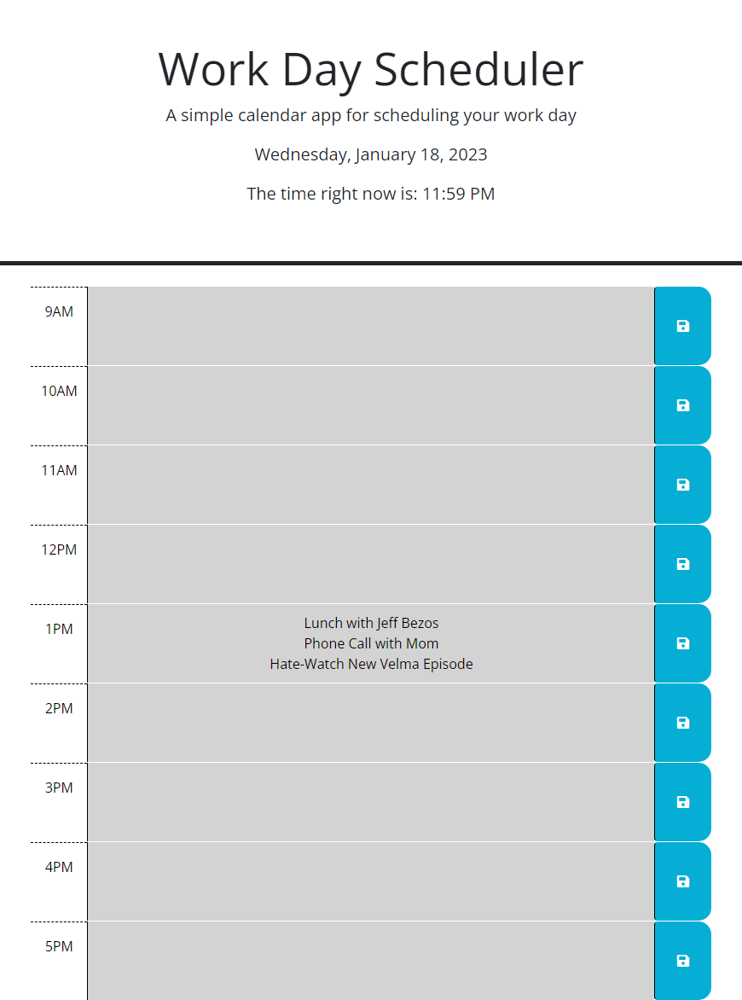
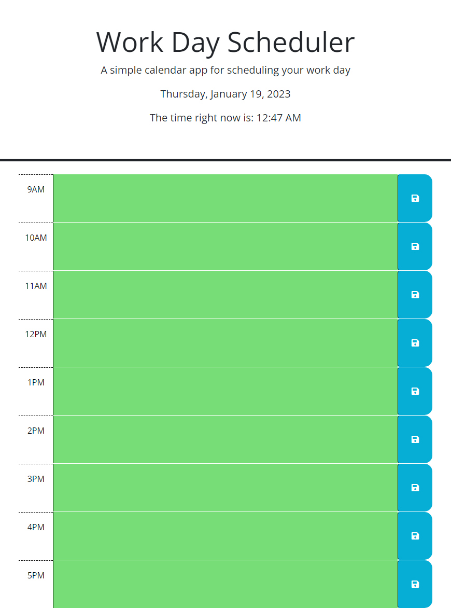

# 05 Third Party APIs - John Mabie

Using day.js and JQuery, I was able to add functionality and correct stylization to the given starter code. The Workday Scheduler works as was set out in the GIVEN/WHEN/THEN prompt. The page displays the current day of the week, month, date of the month, year, and the current time upon loading. This information is also console logged.

I ran into a little struggle with a function designed to clear out the entire page and all Local Storage items upon the clocking hitting Midnight in the User's time zone, and through assistance in Office Hours, that now works correctly. The idea behind it is that the User wouldn't want Monday's schedule to clone over to Tuesday, and when the Save Button is clicked on Tuesday, you wouldn't want any un-touched time block to then re-print with the information sent to Local Storage on Monday (if only superficially cleared, and not also cleared in Local Storage).

In addition to the midnight clear functionality, I added a pop-up that lets the User know that their schedule update has been saved to local storage upon clicking the Save Button for the respective time block. In this, the User will not have to wonder whether or not their information will be retained upon refreshing the page, shy of a new day beginning and clearing everything for their ease of use. Upon adding the midnight clear functionality (where TA suggested removal of a "setTime" function being called afterwards, the items in Local Storage stopped printing to the page upon refresh, readded "setTime", hopefully this doesn't jeopardize the midnight clear).

All time blocks accurately provide stylization (grey for past time blocks, red for current time block, green for future time blocks) and will update upon page refresh, so if you check at 12:59PM and again at 1:01PM, the 12PM time block will change from red to grey, and the 1PM time block will change from green to red, and so forth.

There are a few unused variables left over in the script.js which I plan to return to in order to test some ideas for features:
1) I want to see if I can set it so that if the weekday is 0 (for Sunday) or 6 (for Saturday) that the schedule will replace any saved schedule items with "It's the weekend, enjoy your time off when you have it!" or some such line. 
2) I want to see if I can set it so that if the current day happens to be any federal holiday, regardless of weekday (using really specific && prompts, I expect), that the schedule will replace any saved schedule items with "Today is a Federal Holiday, there is no reason you shouldn't enjoy your Holiday time!" or some such line.
3) I want to see if I can set it so that attempting to add more than 3 schedule items per time block (scheduling anything faster than every 20 minutes), an alert shows up and suggests that the User not overenjamb their schedule beyond 3 schedule items.

These are all extraneous to the requirements of the Challenge, but I'm definitely curious to see what all can be done with a simple scheduler like this! No guarantees on how soon I'll make any edits, but definitely want to experiment with it.

A screenshot of the application when opened in Google Chrome can be seen below:

This screenshot is as of 1/18/2023 at 11:59PM CST, will add updated screenshot(s) once adjustments have been made by way of office hours and tutoring.

A screenshot of the application when opened in Google Chrome can be seen below:

This screenshot is as of 1/19/2023 at 12:47AM CST, will add updated screenshot(s) if any further adjustments are made.

A link to the deployed application can be found below:
https://jmabie94.github.io/1-18-23-jquery-workday-scheduler/